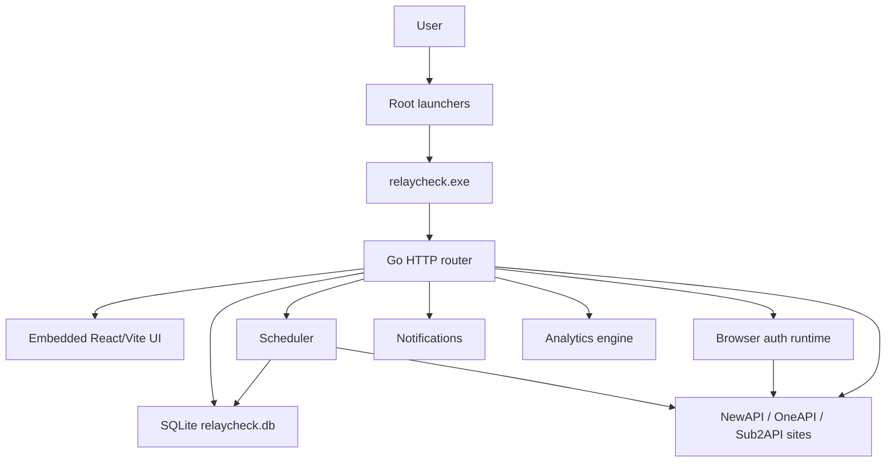

# RelayCheck Desktop

**RelayCheck Desktop** is a local operations console for [NewAPI](https://github.com/Calcium-Ion/new-api), OneAPI, Sub2API, and compatible relay sites. Manage accounts, check-ins, balances, upstream detection, notifications, encrypted backups, and local NewAPI synchronization — all from a single local desktop app.

**Stack:** Go `net/http` backend + React 19 / Vite frontend + SQLite (embedded via modernc.org/sqlite). Single binary, no external server required.

> Official display name: `RelayCheck Desktop v1.1.0`.

---

## Quick Start

### Prerequisites

- Go 1.24+
- Node.js 20+
- npm

### Build & Run

```bash
# 1. Build frontend assets
cd frontend
npm ci
npm run build
cd ..

# 2. Build desktop binary
go build -mod=vendor -o dist/relaycheck.exe .

# 3. Run
./dist/relaycheck.exe
```

Then open **http://127.0.0.1:3001** in your browser.

> On first launch, the bootstrap admin password is printed to the console or written to `data/bootstrap-admin-password.txt`.

### Run Tests

```bash
go test -mod=vendor ./...
go vet ./...
cd frontend && npx tsc --noEmit
```

## Core Documents

| Document | Purpose |
|----------|---------|
| `docs/PROJECT_STRUCTURE.md` | Current source tree, generated paths, archive boundary, and verification order. |
| `DESIGN_SYSTEM.md` | Control Room visual direction and UI rules. |
| `CLAUDE.md` | Architecture guide, verification commands, and conventions for Claude Code / AI agents. |

## Runtime

| Layer | Technology |
|------|------------|
| Desktop/server | Go `net/http`, single embedded executable |
| Frontend | React 19 + Vite, embedded into the Go binary |
| Storage | SQLite at `data/relaycheck.db` |
| Default URL | `http://127.0.0.1:3001` |
| Bootstrap login | `admin` plus `RELAYCHECK_BOOTSTRAP_PASSWORD`; if unset on a fresh DB, read `data/bootstrap-admin-password.txt` |
| Design direction | Control Room: calm, compact, precise, low-noise |

## Architecture



### Architecture Evolution (June 2026)

The `*App` god object in `internal/core/app.go` was progressively decomposed in two phases:

- **Phase 1** — 11 service/store types (CryptoService, AccountAuthRepository, CheckinRunStore, NotificationHub, SyncJobRunStore, SchedulerRepo, ReadCacheStore, BrowserSessionStore, NetworkProxyStore, plus the SharedInfra interface) were extracted within `core`, each owning its state with an independent mutex. `*App` retains thin forwarding methods so existing call sites are unchanged.
- **Phase 2** — 8 domain packages (notifications, backup, versioncheck, legacycheck, autostart, sites, channels, accounts) were split out of `core` into independent `internal/<domain>/` packages using the Infra-interface + mirror-type + `*App`-forwarder pattern. Dependency direction is one-way: `core` → domain. Cross-cutting concerns (audit, crypto, network, URL safety, checkin/balance execution, system settings) intentionally stay in `core`.

See `CLAUDE.md` and `internal/core/PACKAGE_INDEX.md` for the full map.

## Route Overview

| Group | Endpoints |
|-------|-----------|
| System | `/api/system/status`, `/api/system/version-check`, `/api/system/autostart`, `/api/system/legacy-check`, `/api/system/port-check`, `/api/system/settings`, `/api/system/scheduler-status`, `/api/system/proxy-test`, `/api/system/diagnostics`, `/api/system/action-center`, `/api/system/audit-log`, `/api/system/backups`, `/api/system/backup`, `/api/system/export`, `/api/system/import`, `/api/system/exports`, `/api/system/backups/delete`, `/api/system/restore` |
| Scheduler | `/api/scheduler/channel-schedules`, `/api/scheduler/calendar`, `/api/scheduler/next-runs` |
| Tasks | `/api/tasks/start`, `/api/tasks/{id}`, `/api/tasks/dry-run` |
| Analytics | `/api/analytics` (balance trend, checkin distribution, response times, site reliability, balance deltas) |
| Sites | `/api/upstream-sites`, `/api/upstream-sites/bulk-detect`, `/api/upstream-sites/{id}` |
| Channels | `/api/channels`, `/api/channels/bulk-source-status`, `/api/channels/models/overview`, `/api/channels/models/sync`, `/api/channels/{id}` |
| Accounts | `/api/accounts`, `/api/accounts/bulk-open-browser-login`, `/api/accounts/bulk-finish-browser-login`, `/api/accounts/bulk-password-login`, `/api/accounts/bulk-test-api-keys`, `/api/accounts/bulk-refresh-balances`, `/api/accounts/delete-unsupported-checkins`, `/api/accounts/import-legacy-config`, `/api/accounts/import-chrome-passwords/preview`, `/api/accounts/import-chrome-passwords/import`, `/api/accounts/{id}` |
| Checkins | `/api/checkins/today`, `/api/checkins/logs`, `/api/checkins/status`, `/api/checkins/run-all` |
| Balances | `/api/balances/snapshots`, `/api/usage/overview` |
| Models | `/api/models/overview`, `/api/models/sync`, `/api/models/pricing`, `/api/models/pricing/sync` |
| Keys | `/api/keys/export-preview` |
| Notifications | `/api/notifications`, `/api/notifications/mark-all-read`, `/api/notifications/clear-read`, `/api/notifications/mark-read`, `/api/notifications/trim` |
| Local NewAPI | `/api/local-newapi`, `/api/local-newapi/scan`, `/api/local-newapi/import-from-sqlite`, `/api/local-newapi/import-from-admin-api`, `/api/local-newapi/{id}` |
| Health | `/api/health` (unauthenticated) |

## Commands

Run from `E:\zidqiandao\relaycheck-desktop`.

| Command | Purpose |
|---------|---------|
| `cd frontend; npm ci --cache E:\zidqiandao\.npm-cache; npm run build` | Install frontend dependencies and build embedded assets. |
| `cd frontend; $env:RELAYCHECK_SMOKE_PASSWORD='<local password>'; npm run smoke` | Run the browser smoke test against a running local desktop server. |
| `go test -mod=vendor ./...` | Run Go test suite using vendored dependencies, including security, audit, health, and SSRF checks. |
| `go build -mod=vendor -ldflags="-H windowsgui" -o dist\relaycheck.exe .` | Build the Windows desktop executable. |
| `go vet ./...` | Run static analysis (zero warnings expected). |
| `cd frontend; npx tsc --noEmit` | TypeScript type check (zero errors expected). |

Run `npm run build` before Go compilation if `frontend/dist/` is missing; `main.go` embeds that directory at compile time.

## Race / cgo Note

The Windows Go environment used for this workspace currently does not enable cgo. Because Go's race detector requires cgo on this platform, `go test -race ./internal/core` is documented as blocked here with `-race requires cgo`. Use `go test -mod=vendor ./...` as the required local regression gate unless cgo is explicitly enabled in a future toolchain setup.

## Verification Checklist

- `go test -mod=vendor ./...`
- `go vet ./...`
- `cd frontend && npm run build`
- `cd frontend && npx tsc --noEmit`
- `cd frontend && npm audit --audit-level=low`
- Browser smoke on desktop and 390px mobile width: set `RELAYCHECK_SMOKE_PASSWORD`, start the desktop server, then run `cd frontend && npm run smoke`
- No real secrets, passwords, tokens, cookies, or API keys in diffs

## Credential And Export Safety

- Credentials are stored locally in encrypted columns such as `password_encrypted`, `cookie_encrypted`, `access_token_encrypted`, `refresh_token_encrypted`, and `api_key_encrypted`.
- The encryption envelope is AES-GCM with a local instance key stored under `data/keys/instance.key`; encrypted values use the `v1.<nonce>.<ciphertext>` format.
- Encrypted zip export/import uses AES-256-GCM with PBKDF2-SHA256 key derivation (200,000 iterations + random 32-byte salt). The RCZIP2 format is current; RCZIP1 (legacy raw SHA-256) is supported for backward-compatible decryption only.
- Zip import is protected against zip-bomb attacks: total decompressed content is capped at 256 MB, individual entries at 200 MB.
- On a fresh database, the bootstrap admin password is taken from `RELAYCHECK_BOOTSTRAP_PASSWORD`; if that is not set, a generated local password is written under `data/bootstrap-admin-password.txt`, which is ignored by Git.
- API key sharing/export surfaces must only expose fingerprints, masked references, model status, and diagnostic metadata.
- Real passwords, cookies, access tokens, refresh tokens, sync tokens, channel keys, and API keys must never be returned by export endpoints or written into documentation, logs, screenshots, or temporary handoff files.

## Notification Channels

| Channel | Modes | Config Fields |
|---------|-------|---------------|
| Webhook | all / failure / success | URL, HMAC secret, timeout, max retries (exp. backoff: 1s/2s/4s/8s/16s) |
| Telegram | all / failure | Bot token, chat ID |
| Bark | all / failure | URL, group |
| ServerChan | all / failure | SendKey |
| Email (SMTP) | all / failure | SMTP host/port/TLS, username, password, from/to |
| Desktop | all / failure / warning+ | In-app notification with browser Notification API push |

## Analytics

The `/api/analytics?days=N` endpoint provides:

- **Balance trend**: daily average balance (excludes NULL/zero via `AVG(NULLIF(balance, 0))`)
- **Checkin distribution**: 7-day status breakdown (success/already/failed/unsupported/expired)
- **Response times**: API key latency per account
- **Site reliability**: per-site success rate and average latency
- **Balance deltas**: day-over-day change with cumulative total
- **Date range**: selectable 7/30/90 days
- **Drilldown**: click chart points to see per-day details

## Maintenance Notes

- Keep changes focused on this directory unless a task explicitly targets the legacy Python or experimental Next.js implementations.
- Preserve the existing SQLite data file unless a migration task includes a backup and rollback plan.
- Use `docs/PROJECT_STRUCTURE.md` as the source-tree map before deleting or moving files.
- Follow `DESIGN_SYSTEM.md` when changing visual surfaces.
- `/api/health` is intentionally unauthenticated for local startup/smoke checks; business `/api/*` routes use `requireSession` middleware (currently a passthrough for single-user local mode).
- External outbound URLs are validated against SSRF rules by default. Only explicit trusted local probes may opt into loopback/private addresses.
- The scheduler uses `time.FixedZone("CST", 8*3600)` (UTC+8) for consistent scheduling regardless of server timezone.
