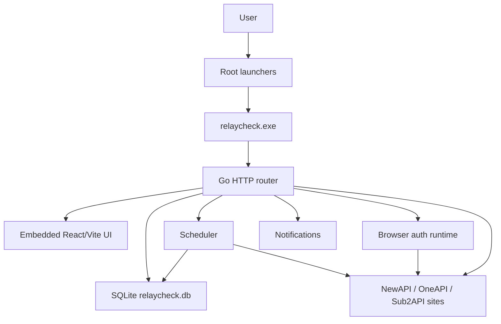
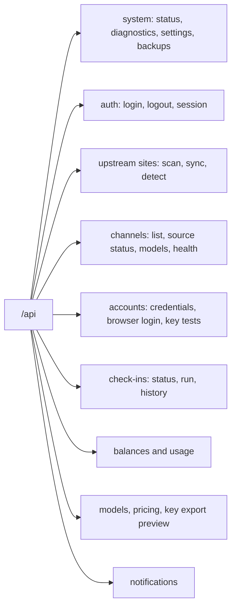

# RelayCheck Desktop

RelayCheck Desktop is the official implementation in this workspace. It is a local operations console for NewAPI, OneAPI, Sub2API, and modified relay sites, with local accounts, check-ins, balances, model/key checks, pricing insights, notifications, backup/restore, and local NewAPI synchronization.

Official display name: `RelayCheck Desktop v1.0`.

## Core Documents

| Document | Purpose |
|----------|---------|
| `PRODUCT_RESEARCH_AND_REQUIREMENTS.md` | Online research synthesis, product boundary, detailed requirements, roadmap, and risk register. |
| `DESIGN_SYSTEM.md` | Control Room visual direction and UI rules. |
| `PROMPT_CHECKLIST.md` | Execution checklist derived from the original optimization prompt. |
| `AGENT_HANDOFF.md` | Resume packet and operational handoff notes for future agents. |

## Runtime

| Layer | Technology |
|------|------------|
| Desktop/server | Go `net/http`, single embedded executable |
| Frontend | React 19 + Vite, embedded into the Go binary |
| Storage | SQLite at `data/relaycheck.db` |
| Default URL | `http://127.0.0.1:3001` |
| Bootstrap login | `admin` plus `RELAYCHECK_BOOTSTRAP_PASSWORD`; if unset on a fresh DB, read `data/bootstrap-admin-password.txt` |
| Design direction | Control Room: calm, compact, precise, low-noise |

## Architecture

## Route Overview

## Commands

Run from `E:\zidqiandao\relaycheck-desktop`.

| Command | Purpose |
|---------|---------|
| `cd frontend; npm ci --cache E:\zidqiandao\.npm-cache; npm run build` | Install frontend dependencies and build embedded assets. |
| `cd frontend; $env:RELAYCHECK_SMOKE_PASSWORD='<local password>'; npm run smoke` | Run the browser smoke test against a running local desktop server. |
| `go test -mod=vendor ./...` | Run Go test suite using vendored dependencies, including security, audit, health, and SSRF checks. |
| `go build -mod=vendor -ldflags="-H windowsgui" -o dist\relaycheck.exe .` | Build the Windows desktop executable. |

## Race / cgo Note

The Windows Go environment used for this workspace currently does not enable cgo. Because Go's race detector requires cgo on this platform, `go test -race ./internal/core` is documented as blocked here with `-race requires cgo`. Use `go test -mod=vendor ./...` as the required local regression gate unless cgo is explicitly enabled in a future toolchain setup.

## Verification Checklist

- `go test -mod=vendor ./...`
- `cd frontend && npm run build`
- `cd frontend && npm audit --audit-level=low`
- Browser smoke on desktop and 390px mobile width: set `RELAYCHECK_SMOKE_PASSWORD`, start the desktop server, then run `cd frontend && npm run smoke`
- No real secrets, passwords, tokens, cookies, or API keys in diffs

## Credential And Export Safety

- Credentials are stored locally in encrypted columns such as `password_encrypted`, `cookie_encrypted`, `access_token_encrypted`, `refresh_token_encrypted`, and `api_key_encrypted`.
- The encryption envelope is AES-GCM with a local instance key stored under `data/keys/instance.key`; encrypted values use the `v1.<nonce>.<ciphertext>` format.
- On a fresh database, the bootstrap admin password is taken from `RELAYCHECK_BOOTSTRAP_PASSWORD`; if that is not set, a generated local password is written under `data/bootstrap-admin-password.txt`, which is ignored by Git.
- API key sharing/export surfaces must only expose fingerprints, masked references, model status, and diagnostic metadata.
- Real passwords, cookies, access tokens, refresh tokens, sync tokens, channel keys, and API keys must never be returned by export endpoints or written into documentation, logs, screenshots, or temporary handoff files.
- If a future encrypted backup/import feature needs real credentials, it must use an explicit encrypted archive flow with a user-provided passphrase and separate tests proving plaintext is not emitted.

## Maintenance Notes

- Keep changes focused on this directory unless a task explicitly targets the legacy Python or experimental Next.js implementations.
- Preserve the existing SQLite data file unless a migration task includes a backup and rollback plan.
- Follow `DESIGN_SYSTEM.md` when changing visual surfaces.
- Update `AGENT_HANDOFF.md`, `progress.md`, and `task_plan.md` after substantial implementation work.
- Use `PROMPT_CHECKLIST.md` as the master checklist for the original optimization prompt; mark each item complete there as work lands.
- `/api/health` is intentionally unauthenticated for local startup/smoke checks; business `/api/*` routes remain session-protected.
- External outbound URLs are validated against SSRF rules by default. Only explicit trusted local probes may opt into loopback/private addresses.
