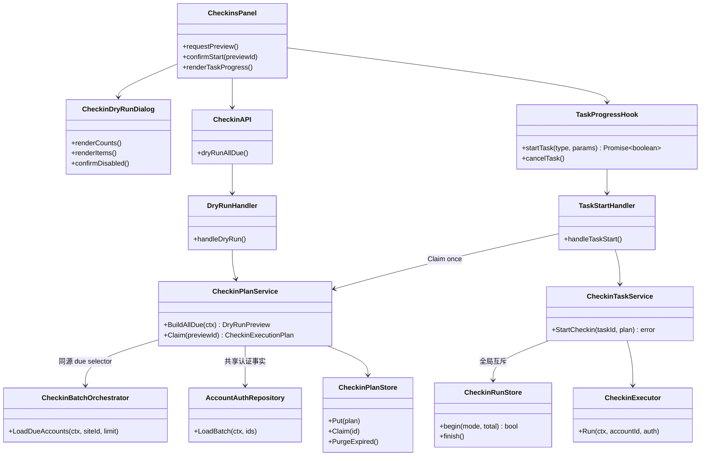
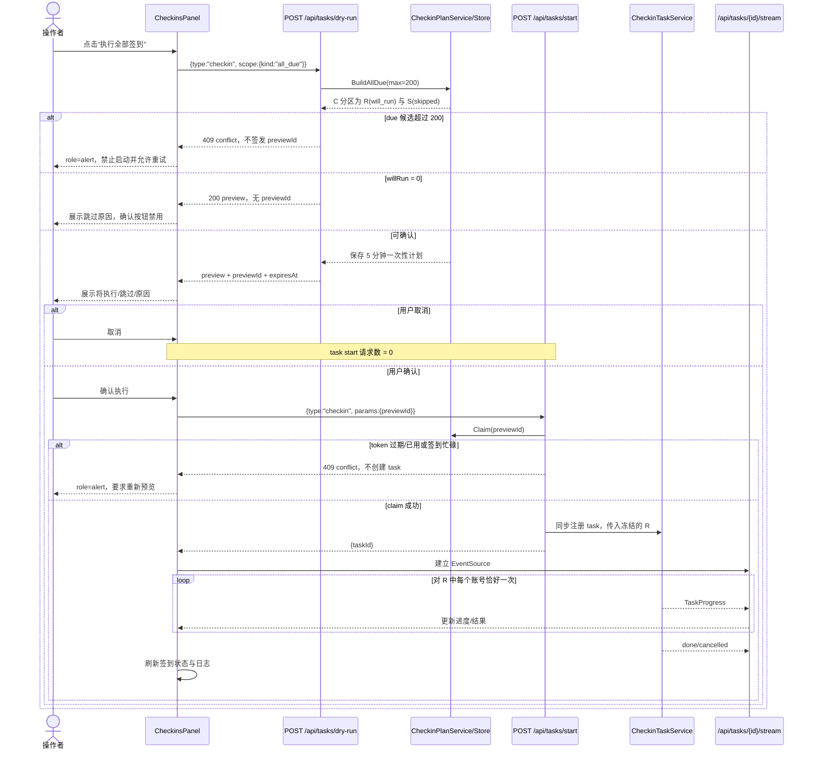

# RelayCheck Desktop 增量架构设计

- **状态：** Accepted（增量落地中）
- **审查日期：** 2026-07-17；2026-07-18 续：AccountInsights models/keys adapter
- **输入：** `docs/sop/relaycheck-incremental-prd.md`、`docs/sop/relaycheck-agent-handoff-prompt.md`
- **决策范围：** P0-A Onboarding 契约修复、P0-B 批量签到安全预览、P1 扫描结果导航；续：AccountInsights 裸 models/keys URL 收敛
- **不在本轮：** `setupProgress`、性能采集、数据库迁移、路由框架替换、设计系统重写、一次性前端 API 全量重构

## 1. 审查结论

当前代码**不能保证** dry-run 与 `/api/tasks/start` 的签到候选集合一致，不能只增加前端确认弹窗。

证据如下：

| 证据 | 当前行为 | 结论 |
|---|---|---|
| `frontend/src/components/checkins/CheckinsPanel.tsx:201-208` | “执行全部签到”直接调用 `task.startTask("checkin")`。 | 没有预览和确认。 |
| `frontend/src/hooks/useTaskProgress.ts:50-71` | `POST /api/tasks/start` 后立即连接 SSE。 | 前端没有候选账号事实源。 |
| `internal/core/task_runner.go:250-285,384-386` | handler 接收 `params`，但 checkin 分支丢弃参数。 | task start 无法消费前端预览集合。 |
| `internal/core/checkin_task_service.go:33-53` | goroutine 内重新执行 `LoadDueAccounts(ctx, "", 0)`。 | 确认后重新选集，存在 TOCTOU；且 `limit=0` 无上限。 |
| `internal/core/checkin_batch_orchestrator.go:96-127` | due 规则只看 `last_checkin_status/last_checkin_at`，按 `updated_at DESC` 排序；不筛 `supports_checkin/login_status/auth_type`。 | 真实 task 候选是“今日未成功/未已签”的全部账号，而不是 dry-run 的 `will_run` 子集。 |
| `internal/core/dry_run.go:34-53` | checkin dry-run 要求调用方显式提交 `accountIds`，最多 200。 | ID 来源与 task start 不同；前端无法从签到状态接口取得这组 ID。 |
| `internal/core/dry_run.go:69-152` | 只读取 `login_status/auth_type/supports_checkin` 并独立分类。 | 没有考虑已保存密码、access token、API key、`checkin_config_json`；与执行器能力口径不同。 |
| `internal/core/account_auth_repo.go:42-84` | `AccountAuthRepository` 才会解密并合并真实认证能力，自定义签到规则也会将 `SupportsCheckin` 置真。 | 可执行性必须基于该仓储输出，不能在 handler 复制弱化规则。 |
| `internal/core/account_session_service.go:32-40` | Cookie、API Key、带用户 ID 的 access token，或登录名+密码均可建立会话。 | `login_status != valid` 不等价于必须跳过。 |
| `internal/core/checkin_executor.go:31-52` | 执行器会处理“不支持/凭据不可用”并写本地结果。 | 现有 dry-run 的 `skip_*` 并不等于现有 task 不处理。 |
| `internal/core/checkin_batch_orchestrator.go:40-51` | 调度/旧 run-all 使用 `CheckinRunStore.begin` 防并发。 | 这是现有全局签到互斥事实源。 |
| `internal/core/checkin_task_service.go:33-75` | task service 未调用 `CheckinRunStore.begin/update/finish`。 | task start 可与另一 task、scheduler 或旧 run-all 并发。 |
| `internal/core/task_runner.go:250-285` 与 `CheckinTaskService.StartCheckin` | task 在 goroutine 中注册，handler 可能先返回 taskId。 | EventSource 立即连接时存在 task 尚未注册的窄竞态。 |

### 1.1 集合一致性判定

定义：

- `C`：一次 dry-run 时由后端 `LoadDueAccounts(ctx, "", max+1)` 得到的有序 due 候选集合。
- `R`：用共享本地可执行性分类器从 `C` 中得到的 `will_run` 有序子集。
- `S`：同一分类器从 `C` 中得到的 skipped 子集，`C = R ∪ S` 且 `R ∩ S = ∅`。
- `T`：用户确认后 task 实际逐项迭代的账号集合。

当前实现中，dry-run 的 `C` 由调用方提交，task start 的 `T` 在确认后重新查询，因此无法证明 `T = R`，也无法保证 `|T| <= 200`。

本设计要求：服务端在 dry-run 时冻结 `R`，task start 只消费该冻结计划且不重新扩展账号，故 `T = R`。账号在确认后被删除或凭据发生变化时，执行结果可以变为失败，但 task 不得替换、追加任何未预览账号。

## 2. 候选方案与取舍

### 方案 A：前端查询账号 ID，再分别提交 dry-run 和 task start

前端从账号列表拼出 `accountIds`，dry-run 和 task start 都回传这组 ID。改动看似最少，但账号列表没有 due 查询契约，分页/筛选/200 上限与后端执行规则都不同；调用方还能伪造集合。确认期间的账号状态变化也没有受控快照。

### 方案 B：无状态 selection hash，start 时重算并校验

dry-run 返回有序 ID 和 hash；start 重查 due 集合并比较 hash，一致才执行重查结果。它无需服务端缓存，但 start 仍需第二次查询和分类，且校验与 goroutine 执行之间仍要显式传递快照；重放同一 hash 也不能自然阻止双击。

### 方案 C：服务端短 TTL、一次性签到计划（推荐）

dry-run 使用真实 due selector 和共享分类器生成计划，将不含秘密的执行快照保存在进程内，返回随机 `previewId`。start 原子消费 `previewId`，同步注册 task，再异步迭代冻结的 `R`。计划短期、单次、进程内有效，天然 fail closed，并与本地单进程产品形态一致。

| 维度 | 方案 A | 方案 B | 方案 C |
|---|---|---|---|
| 实现复杂度 | 前端简单，后端仍需新增按 ID 执行分支 | 需 hash 规范化、重查、比较和快照传递 | 需小型内存 store、计划构建器和消费流程 |
| 运维成本 | 无新组件，但正确性依赖前端 | 无持久状态 | 无外部服务；重启后预览自然失效 |
| 集合一致性 | 无法证明来源同源 | start 校验时可证明，需额外防重放 | `T = R` 直接由一次性计划保证 |
| 200 上限 | 前端分页可能遗漏或截断 | 后端可统一拒绝超限 | 后端统一拒绝超限且不签发 token |
| 竞态/双击 | 高；同一 ID 可重复启动 | hash 可重放，需另加幂等机制 | token 单次消费；第二次 start 返回 409 |
| 故障恢复 | 容易危险降级 | stale 时需重新预览 | 过期/重启/冲突均重新预览 |
| 数据与依赖 | 无新依赖 | 无新依赖 | 无新依赖、无 DB schema；仅少量内存 |
| 演进空间 | 规则继续散落 | 可演进成版本化快照 | 可扩展到 per-site scope 或持久任务计划 |

**推荐：方案 C。** 原因是它以最小的本地内存状态同时解决事实源、TOCTOU、200 上限、重放和并发，不引入数据库或第三方依赖。

何时改选方案 B：产品未来改为多进程/多实例，且不能使用共享持久计划存储时。方案 A 不应采用。

## 3. 目标架构

### 3.1 模块关系



### 3.2 dry-run 到进度的时序



### 3.3 框架选择

- 后端继续使用 Go `net/http`、现有 service/repository 与 `sync.Mutex`；计划 store 是进程内领域服务，不引入缓存、中间件或工作流框架。
- 前端继续使用 React 19 本地 state、现有 `api<T>`、`useTaskProgress`、`DialogShell` 和项目自有 UI primitives；不引入路由库、query 框架或新组件库。
- 真实交互回归复用已安装 Playwright；Vitest 负责纯逻辑、静态渲染和 fetch 契约。

## 4. 后端契约与实现约束

### 4.1 共享签到计划

新增内部类型（命名可按 Go 风格微调，但字段语义不可改变）：

```go
type CheckinExecutionPlan struct {
    ID          string
    CreatedAt   time.Time
    ExpiresAt   time.Time
    Candidates  []DryRunPreviewItem
    RunAccounts []checkinRunAccount // 只含 action=will_run，保持预览顺序
}

type CheckinPlanStore struct {
    mu    sync.Mutex
    plans map[string]CheckinExecutionPlan
}
```

固定约束：

1. `checkinPreviewTTL = 5 * time.Minute`；`maxPendingCheckinPreviews = 64`。
2. `BuildAllDue` 必须调用 `CheckinBatchOrchestrator.LoadDueAccounts(ctx, "", maxDryRunAccounts+1)`，不得复制 due SQL。
3. 若得到 201 条，返回 HTTP 409，消息明确“单次预览最多 200 个账号”；不截断执行、不签发 `previewId`。
4. 同一 query 的主键 ID 天然唯一；计划仍应防御性去重并保持首次出现顺序。
5. 分类必须基于 `AccountAuthRepository.LoadBatch` 的输出；仓储查询/迭代错误使整个 preview fail closed，不能把错误账号静默归类为 skipped：
   - `skip_not_found`：due 查询后账号在 auth 查询前已被删除，`auth` 不存在；
   - `skip_unsupported`：`auth` 存在但 `!auth.SupportsCheckin`；
   - `will_run`：支持签到且具有 Cookie、任意非空 AccessToken、API Key，或 `LoginName + Password`；
   - `skip_missing_credentials`：支持签到但没有上述任何本地认证路径。
6. 将上述认证判断提取为纯函数（例如 `canAttemptCheckin(auth)`），由计划分类器与 `CheckinExecutor` 的本地前置判断共同调用，避免第三套规则。`login_status` 仅用于提示，不单独决定跳过；远端是否成功只能由执行阶段决定。
7. store 只保存 ID、显示名、站点 ID/名、action/reason 和时间；不得保存 Cookie、密码、token、API key 或 profile 路径。
8. `Claim` 在 mutex 内检查存在/过期并删除；同一 `previewId` 最多成功一次。清理采用 Put/Claim 时惰性清理，不新增后台服务。
9. Put 时先清理过期项；清理后仍达到 64 条则返回 HTTP 429 `rate_limited`，不得驱逐另一项未过期计划。
10. App 重启后所有预览失效是预期的 fail-closed 行为。

### 4.2 Dry-run API

checkin 使用新 scope 契约；`test/identify` 的显式 `accountIds` 兼容路径可以保留，但不得签发可启动 checkin 的 `previewId`。

请求：

```json
{
  "type": "checkin",
  "scope": { "kind": "all_due" }
}
```

成功响应仍由现有 `{ok,data}` envelope 包裹：

```json
{
  "ok": true,
  "data": {
    "type": "checkin",
    "previewId": "opaque-random-id",
    "expiresAt": "2026-07-17T10:05:00Z",
    "maxAccounts": 200,
    "totalAccounts": 4,
    "willRun": 2,
    "skipped": 2,
    "items": [
      {
        "accountId": "account-id",
        "accountName": "账号名",
        "siteName": "站点名",
        "action": "will_run",
        "reason": "本地认证条件已就绪，将尝试签到"
      }
    ]
  }
}
```

- `willRun == 0` 时响应 200，但省略 `previewId`；前端必须禁用确认。
- 缺少 scope/type 使用 400 `validation_error`。
- 超过 200 使用 409 `conflict`，不返回部分可执行计划。
- 500 继续经 `writeError/writePublicError` 脱敏；不得向 UI 回显 SQL 或解密错误。

### 4.3 Task start API

请求：

```json
{
  "type": "checkin",
  "params": { "previewId": "opaque-random-id" }
}
```

约束：

1. `TaskCheckin` 必须提供一次性 `previewId`；缺失为 400，过期/未知/已消费为 409。
2. claim 成功后只把计划中的 `RunAccounts` 传给 `CheckinTaskService`，禁止再次调用 `LoadDueAccounts`。
3. `CheckinTaskService.StartCheckin` 先同步调用 `CheckinRunStore.begin("manual.task", len(R))` 并在 `TaskRunner` 注册，再返回 taskId；这样同时阻止 scheduler、旧 run-all 和另一 preview task 并发，并消除 SSE 先于 task 注册的竞态。
4. 若全局签到忙碌，返回 409 且不创建 task。已 claim 的 token 不复用，操作者待当前任务结束后重新预览。
5. 执行循环对 `R` 中每个 ID 恰好产生一个 `TaskProgress` item；账号确认后被删除时以脱敏 failed item 结束，不能补入新账号。
6. 同步更新 `CheckinRunStore` 的 current/result/finish，以保持 `/api/checkins/status` 与 TaskProgress 语义一致。
7. 非 checkin task 的请求/响应保持现状。

### 4.4 旧入口边界

- Scheduler 继续直接调用 `CheckinBatchOrchestrator.Run/RunForSite`，不要求交互预览。
- `/api/checkins/run-all` 当前没有前端调用者，但仍是可信本机兼容 API。本轮不改变它的响应结构；它继续受 `CheckinRunStore` 互斥保护。
- 本轮保证的是 UI “执行全部签到”与 `/api/tasks/start` 的安全契约。是否废弃 `/api/checkins/run-all` 作为后续 API 兼容性决策记录，不得把它重新接到前端。

## 5. 前端契约与交互

### 5.0 typed API adapter 边界（2026-07-18 续）

| Owner | 路径 | 组件职责 |
|---|---|---|
| `checkinApi` | `frontend/src/api/checkins.ts` | CheckinsPanel 只消费 preview |
| `accountCleanupApi` | `frontend/src/api/account-cleanup.ts` | AccountInsights 只调用 preview/confirm |
| `modelsApi` | `frontend/src/api/models.ts` | AccountInsights 不拼 `/api/models/*` |
| `keysApi` | `frontend/src/api/keys.ts` | AccountInsights 不拼 `/api/keys/*` |
| `localNewapiApi` | `frontend/src/api/local-newapi.ts` | Onboarding 连接步骤只调用 importFromAdmin |
| `channelsApi` | `frontend/src/api/channels.ts` | models/health + detect/source-status/bulk；ChannelTable/useChannelActions/Onboarding/ChannelsPanel 不拼 `/api/channels/*` |
| `localNewapiApi` | `frontend/src/api/local-newapi.ts` | importFromAdmin + list/exclude/autoDetect/sync；Scan/LocalNewAPISync/Onboarding 共用 |
| `notificationsApi` | `frontend/src/api/notifications.ts` | markAllRead/clearRead/trim；NotificationsPanel 不拼写路径 |
| `systemApi` | `frontend/src/api/system.ts` | Settings 读写与探测；备份恢复语义不变，确认框仍在 UI |
| `schedulerApi` | `frontend/src/api/scheduler.ts` | SiteSchedules 排程 list/save/calendar/nextRuns |
| `sitesApi` | `frontend/src/api/sites.ts` | 上游站点只读 list（排程初始化） |

约束：

1. 后端契约先行；adapter 只映射稳定 URL/body/schema，不复制业务筛选或删除集合逻辑。
2. 同步类 POST 仅发送声明字段（如 `limit`），未知字段不得从 UI 透传。
3. Key 导出预览必须只读；测试夹具与断言禁止真实密钥明文。
4. 一次只收敛一个业务面的裸 API；禁止整仓前端大重构。

### 5.1 TypeScript 类型

在 `frontend/src/api/checkins.ts` 定义并导出：

```ts
export type CheckinDryRunAction =
  | "will_run"
  | "skip_not_found"
  | "skip_unsupported"
  | "skip_missing_credentials";

export type CheckinDryRunItem = {
  accountId: string;
  accountName: string;
  siteName: string;
  action: CheckinDryRunAction;
  reason: string;
};

export type CheckinDryRunPreview = {
  type: "checkin";
  previewId?: string;
  expiresAt?: string;
  maxAccounts: 200;
  totalAccounts: number;
  willRun: number;
  skipped: number;
  items: CheckinDryRunItem[];
};

export type CheckinStartParams = { previewId: string };
```

API wrapper：

```ts
checkinApi.previewAllDue(): Promise<CheckinDryRunPreview>
```

它必须通过现有 `api<T>` 调用 `/api/tasks/dry-run`，不自行 fetch/解析第二套 envelope。

### 5.2 CheckinsPanel 状态机

状态：`idle -> previewLoading -> previewReady -> startPending -> taskRunning`，错误从 `previewLoading/startPending` 回到可重试状态。

- 每次点击“执行全部签到”都清空旧 preview 并重新请求；不缓存“不再提示”。
- preview 失败时 Dialog 保持打开，使用稳定 `role="alert"`，不得调用 start。
- 取消只关闭并清空 preview，start 请求数为 0。
- `willRun == 0` 或没有 `previewId` 时确认禁用，并提供“前往站点与账号修复凭据/能力”的动作。
- 对话框最多渲染前 12 个 item；`items.length - 12 > 0` 时显示“另有 N 条”。这只是 UI 展示上限，不改变后端计划。
- `startPending` 与 `task.loading/running` 同时禁用主按钮；后端一次性 token 是最终防重放边界。
- `useTaskProgress.startTask` 返回 `Promise<boolean>`；仅成功建立 task/SSE 时关闭预览。失败保留错误和重试入口。
- Task done 后沿用现有 `onRefresh`；取消与 `TaskProgressView` 语义不变。

预览使用现有 `DialogShell variant="modal"`，不新增 Radix/shadcn。标题、计数、跳过原因同时使用文字与图标/状态标签；390px 单列且按钮触控目标至少 44px。

### 5.3 Onboarding

- `OnboardingWizard` 新增 `onNavigate` prop，`main.tsx` 传入现有 `handleNavigate`。
- 步骤 3 全部改为“站点与账号 -> 全部账号”，删除“左侧账号页”。
- 步骤 4 不再调用 `/api/tasks/start`；主动作导航到 `checkins` 并携带 `checkinPreview: "open"`。
- `CheckinsPanel` 收到该 intent 后调用与页面按钮相同的 `requestPreview`，不得复制 API/分类逻辑。
- “完成”只写 onboarding done flag 并关闭向导，不暗示账号已验证成功。
- 保持 Access Token 为 password input，不改变手工登录/2FA/CAPTCHA 边界。

`NavigationIntent` 增加：

```ts
checkinPreview?: "open";
```

### 5.4 ScanPanel

- `ScanPanel` 新增已有风格的 `onNavigate(tab, intent?)` prop，`main.tsx` 传入 `handleNavigate`。
- `result.found` 且至少一个 result 无 error，并有 `importedCount/sitesCreated/sitesMerged` 任一大于 0 时展示：
  - “查看渠道” -> `onNavigate("channels")`
  - “前往站点与账号” -> `onNavigate("sites", {accountsView:"all"})`
- 不附加 `sourceStatus` 或其他过滤器，避免隐藏新数据。
- 全失败不显示导航；混合结果保留成功导航与现有错误提示。

## 6. 精确文件清单

工程师只能在下表范围内修改；开始前必须再次检查每个文件当前 diff。当前工作树中 `CheckinsPanel.tsx`、`OnboardingWizard.tsx`、`ScanPanel.tsx`、`main.tsx`、`types/navigation.ts`、`task_runner.go`、`checkin_task_service.go`、`checkin_executor.go` 等已有用户改动，必须在当前内容上增量编辑。

| 路径 | 动作 | 目的 |
|---|---|---|
| `internal/core/checkin_plan.go` | 新增 | 共享计划构建、分类、一次性 store、TTL/容量边界。 |
| `internal/core/app.go` | 修改 | 装配 `CheckinPlanService/Store`，不扩散其他 App 职责。 |
| `internal/core/dry_run.go` | 修改 | checkin scope 契约委托计划服务；保留非 checkin 兼容路径。 |
| `internal/core/task_runner.go` | 修改 | checkin 强制 claim preview、同步注册、错误清理。 |
| `internal/core/checkin_task_service.go` | 修改 | 消费冻结计划，不重查 due；接入全局签到互斥/状态。 |
| `internal/core/checkin_executor.go` | 修改 | 与计划分类器共用 `canAttemptCheckin` 本地前置判断，避免规则漂移。 |
| `internal/core/checkin_plan_test.go` | 新增 | 选择、分类、去重、TTL、一次消费、200+ fail-closed。 |
| `internal/core/dry_run_test.go` | 修改 | 新请求/响应、0 可执行、超限、敏感字段不泄露。 |
| `internal/core/task_runner_test.go` | 修改 | 缺 token、已用 token、双 start、忙碌、同步 task 注册。 |
| `internal/core/checkin_task_service_test.go` | 修改 | `T=R`、顺序、取消、CheckinRunStore 与 TaskProgress 一致。 |
| `internal/core/checkin_execution_services_test.go` | 修改 | 执行器与计划共用认证前置判断的回归测试。 |
| `frontend/src/api/checkins.ts` | 新增 | dry-run API 与 TS 契约。 |
| `frontend/src/api/__tests__/checkins.test.ts` | 新增 | URL、method、body、envelope/error 契约。 |
| `frontend/src/components/checkins/CheckinDryRunDialog.tsx` | 新增 | 可访问的预览/确认 UI。 |
| `frontend/src/components/checkins/CheckinsPanel.tsx` | 修改 | 预览状态机、确认后 start、intent 复用。 |
| `frontend/src/components/checkins/__tests__/CheckinDryRunDialog.test.tsx` | 新增 | 计数、跳过原因、0 可执行、另有 N 条、alert/disabled。 |
| `frontend/src/hooks/useTaskProgress.ts` | 修改 | `startTask` 返回成功布尔值，保持现有状态/SSE 行为。 |
| `frontend/src/types/navigation.ts` | 修改 | 增加 `checkinPreview` intent。 |
| `frontend/src/components/onboarding/OnboardingWizard.tsx` | 修改 | 修文案；最后一步导航预览，不直接 start。 |
| `frontend/src/components/onboarding/__tests__/OnboardingWizard.test.tsx` | 修改 | 静态契约和辅助逻辑；真实交互由 smoke 覆盖。 |
| `frontend/src/components/scan/ScanPanel.tsx` | 修改 | 成功/混合结果后的两种导航。 |
| `frontend/src/components/scan/__tests__/ScanPanel.test.tsx` | 修改 | 成功判定和导航渲染的纯/静态契约。 |
| `frontend/src/main.tsx` | 修改 | 向 Onboarding/Scan 传 `handleNavigate`。 |
| `frontend/src/styles/domains/checkins.css` | 修改 | 预览 modal、列表、计数、390px 响应式。 |
| `frontend/src/styles/domains/scan.css` | 修改 | 下一步动作行与窄屏换行。 |
| `frontend/scripts/verify-incremental-flows.mjs` | 新增 | Playwright 真实点击/API 顺序/取消/错误/导航/390px smoke。 |
| `frontend/package.json` | 修改 | 增加 `smoke:incremental` 脚本；不改依赖版本。 |

明确无需修改：`internal/core/routes.go`（两条路由已存在）、`internal/core/checkin_batch_orchestrator.go`（继续作为 due selector）、`frontend/src/components/ui/dialog-shell.tsx`、`frontend/src/lib/navigation.ts`、`go.mod/go.sum/package-lock.json`。

若实现发现必须超出清单，工程师应先退回主理人/架构师核准，不能顺手格式化或重构其他脏文件。

### 6.1 依赖变化

**无依赖变化。** 不修改 `go.mod`、`go.sum`、`frontend/package-lock.json` 或 dependencies/devDependencies；`frontend/package.json` 只增加调用现有 Playwright 的脚本命令。若实现需要安装任何包，必须停止并重新进行架构审查。

## 7. 实施任务与依赖顺序

1. **后端计划内核**：新增 `checkin_plan.go` 与单元测试；先证明 `C/R/S`、认证分类和 200 上限。
2. **后端消费契约**：修改 dry-run、task start、task service；证明 `T=R`、token 单次、并发互斥、SSE 注册顺序。
3. **前端 API 与预览组件**：建立 TS 契约、API 测试、Dialog 静态测试。
4. **CheckinsPanel 闭环**：接入状态机、确认/取消/0/错误/重试，保留 TaskProgress。
5. **Onboarding**：修改文案和导航 intent，复用第 4 步的同一预览入口。
6. **ScanPanel**：接入两种默认导航，覆盖成功/混合/失败。
7. **浏览器 smoke 与门禁**：新增增量流程 smoke，再运行前后端全门禁和一致性审查。

依赖关系：1 -> 2 -> 3 -> 4 -> 5；3 与 6 可并行，但本专项 SOP 要求同一工程师顺序完成并统一审查。

## 8. 测试策略

### 8.1 Go 单元/handler 测试

必须覆盖：

1. due selector fixture 同时含今日成功、今日已签、历史成功、未运行、不支持、缺凭据、可密码登录、自定义 checkin rules。
2. dry-run 与 task 使用同一计划 fixture，断言 task result ID 的有序集合严格等于 preview 中 `action=will_run` 的 ID 集合。
3. 第 201 个 due 账号使 dry-run 返回 409，store 为空，task start 数为 0。
4. `willRun=0` 不签发 previewId；伪造/过期/已消费 token 均不能创建 task。
5. 两个并发 start 使用同一 token，只有一个成功；两个不同 token 与 scheduler/旧 run-all 互斥。
6. preview 后新增 due 账号，原 task 不包含它；删除计划账号时不替换账号，返回脱敏失败 item。
7. task 在 start handler 返回前已注册，紧接着的 stream 不返回 404。
8. cancel 中止剩余计划项；done/cancelled 后 `CheckinRunStore` 必须 finish。
9. 响应/日志不含 Cookie、password、token、API key、数据库绝对路径。

### 8.2 前端 Vitest

- API 测试 mock `fetch`，断言 dry-run 精确 body、same-origin、错误状态不触发 start。
- Dialog 静态/纯逻辑测试覆盖计数、原因、前 12 项、“另有 N 条”、确认禁用、`role=alert`。
- Onboarding 断言旧“左侧账号页”消失，步骤 4 源码/渲染不再含直接 start 文案。
- Scan success predicate 覆盖成功、混合、全失败、found 但 0 导入。

项目未安装 jsdom/testing-library，不为本切片引入大型测试依赖；真实点击使用现有 Playwright 依赖。

### 8.3 Playwright 增量 smoke

`verify-incremental-flows.mjs` 使用 route mock 覆盖：

1. 点击批量签到只发生 dry-run；确认前 start=0；确认后顺序为 dry-run -> start -> SSE，start 仅一次。
2. 取消、0 可执行、dry-run 错误/重试、过期 token 409。
3. Onboarding 四步切换、返回/重开无串步、最后一步导航并打开同一预览，不直接 start。
4. Scan 成功、混合、全失败；两个按钮分别落到渠道和“站点与账号 -> 全部账号”，无隐式过滤。
5. 1440x900 与 390x900 无横向溢出，焦点可见，modal Escape/Tab/焦点恢复工作。

### 8.4 质量门禁

按仓库实际脚本执行：

```powershell
rtk go test -mod=vendor -count=1 ./internal/core/
rtk go test -mod=vendor -count=1 ./ ./internal/...
rtk go vet -mod=vendor ./ ./internal/...

Set-Location E:\zidqiandao\relaycheck-desktop\frontend
rtk npm run format:check
rtk npm run lint
rtk npx tsc -b
rtk npm run test:coverage
rtk npm run build
rtk npm run budget:check
rtk npm run smoke:incremental
```

smoke 需要先启动现有 loopback backend/dev server 并使用脚本支持的 base URL；不得把未运行的真实目标机验收或线上 p95 写成通过。

## 9. 回滚与兼容边界

- **无 DB 迁移、无持久格式变化、无新依赖。** 回滚不涉及数据恢复。
- P0-B 的后端契约与 CheckinsPanel 必须作为一个原子回滚单元。若只回滚后端，新前端 dry-run 会安全失败，不能降级为直接 start；若只回滚前端则重新暴露危险直启入口，因此禁止半回滚上线。
- Onboarding、Scan 导航各自可独立回滚，不影响签到计划。
- 进程重启仅清空未消费 preview；已有 TaskRunner/CheckinRun 的进程内语义保持现状。
- Scheduler、单账号签到、任务取消、RCZIP、SQLite schema、session token、Origin/RemoteAddr 防护均不变。
- 若计划 store 出现问题，回滚到“禁止批量启动并显示维护提示”也比恢复无预览直启更安全。

## 10. 风险与缓解

| 风险 | 等级 | 缓解 |
|---|---|---|
| 当前工作树大量未提交修改被覆盖 | 高 | 以磁盘当前内容为基线，逐文件看 diff；只改第 6 节清单，不全局格式化。 |
| 200+ due 账号无法通过“全部签到”一次执行 | 中 | fail closed，不部分执行；UI 明示上限并引导处理不支持/缺凭据账号。后续再设计 per-site/cursor batch。 |
| preview 后凭据/站点能力变化 | 中 | token 只冻结成员，不承诺远端结果；不扩展集合，执行失败可恢复；5 分钟 TTL 降低陈旧窗口。 |
| preview token 被重复或跨窗口使用 | 低 | 随机 ID、same-origin/session 边界、一次 claim、64 条容量和 5 分钟 TTL。 |
| 任务与 scheduler 并发 | 中 | task service 接入现有 `CheckinRunStore.begin/finish`，busy 返回 409。 |
| Onboarding 复制预览规则 | 中 | 只发送 navigation intent，由 CheckinsPanel 触发唯一 preview 状态机。 |
| 新 smoke 只在模拟 API 下通过 | 低 | 同时运行 Go handler/service 测试；真实目标机仍由人工验收。 |

## 11. 待明确事项与产品回退判定

本轮默认产品决策已经足够，**无需退回产品阶段**：

- 每次批量签到都重新 dry-run；无“不再提示”。
- scope 是后端同源 `all_due`，不是当前日志筛选或账号分页。
- Onboarding 导航到签到页并打开同一预览。
- Scan 打开默认目标面板，不加过滤。
- 超过 200 时 fail closed，不执行隐式前 200。

非阻塞后续事项：

1. 是否正式废弃 `/api/checkins/run-all` 兼容端点；本轮不得由前端调用它。
2. 200+ 账号的 per-site/cursor 批处理产品设计；在有明确需求前不扩展。
3. `setupProgress` 的“首次验证完成”事实口径与性能/RUM 采集继续留在后续切片。

## 12. ADR 摘要

**Decision：** 批量签到采用服务端生成、短 TTL、一次性消费的执行计划；task start 只能消费计划中的 `will_run` 有序集合。

**Consequences：**

- 正面：能证明 `T=R`，200 上限和双击/TOCTOU/调度并发均 fail closed。
- 负面：App 重启、token 过期、busy 冲突都要求重新预览；200+ 暂时阻止批量执行。
- 风险：计划冻结成员但不能预测远端 API 结果；UI 文案必须使用“将尝试执行”，不能承诺成功。

**Revisit triggers：** 多进程部署、单次稳定超过 200 个 due 账号、需要跨重启恢复预览，或公开 API 需要长期兼容时，重新评估持久计划与分批协议。

## 13. 增量决策：不支持签到账号清理同源（2026-07-18）

### 13.1 问题与边界

旧契约以同一路由的 `dryRun=true/false` 区分预览与删除，但两次请求都会按 `updated_at DESC` 重新选择候选。预览后新增或更新账号时，实际删除集合可能不是用户看到的集合；空 body 还会因布尔零值进入删除路径。

本决策只收紧现有“清理不支持签到账号”命令，不修改 SQLite schema、站点删除语义、外键、真实数据库或 WAL。

### 13.2 后端契约

1. 预览：`POST /api/accounts/delete-unsupported-checkins`，body 为 `{dryRun:true,limit,includeLastUnsupported}`。
2. 有候选时返回 `previewId/expiresAt`；计划保存在进程内，TTL 5 分钟，容量 64，一次性 Claim。
3. 确认：body 只能是 `{previewId}`，兼容接受显式 `dryRun:false`，但拒绝重新提交 limit 或 include 范围。
4. 事务只复核冻结 ID。任一 ID 缺失或不再满足原资格时整批 409；不能用新候选补位。
5. 签到日志、余额快照、账号删除共享同一事务；最终账号删除数不等于冻结数时回滚。
6. 空 body/缺失 ID 返回 400；过期、重放、状态漂移返回 409；容量耗尽返回 429；均不写数据。
7. 数据库恢复重绑时持写锁切换连接并清空旧 preview；预览/确认持读锁覆盖查询或事务，token 不得跨数据集。

### 13.3 前端边界

- `frontend/src/api/account-cleanup.ts` 独占请求 path/body/type，组件不再使用裸 URL 或 `dryRun`。
- `UnsupportedCheckinCleanupPanel` 是受控展示组件，只接收冻结预览与 owner callbacks；二次确认只回传当前 `previewId`。
- `AccountInsights` 负责请求状态和用户消息；任意确认失败都必须清空已消费预览，不能降级为直接删除或原地重试。

### 13.4 验证与回滚

- Go 覆盖候选新增、状态漂移、空 body、参数重选、过期/重放、容量、并发双确认、DB 重绑和事务回滚。
- Vitest 覆盖 typed body、零候选、预览前禁删、取消零确认、同一 ID 透传和范围切换清空。
- Playwright 覆盖 preview -> cancel、preview -> confirm、409 与 500 恢复。
- 无迁移、无新依赖。后端与前端契约必须成对回滚；回滚不得恢复空 body 或二次重选候选的删除行为。
